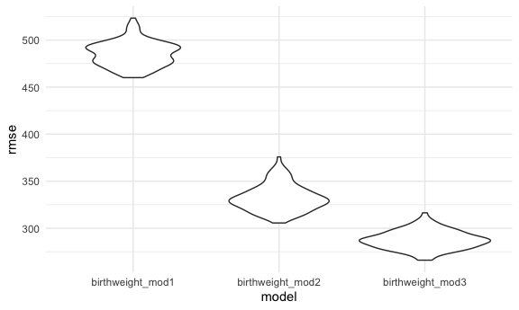

Homework6
================

## Problem 1

In this problem, you will analyze data gathered to understand the
effects of several variables on a child’s birthweight. This dataset,
available here, consists of roughly 4000 children and includes the
following variables:

``` r
birthweight_data = read_csv("./birthweight.csv") %>% 
janitor::clean_names()
```

    ## Rows: 4342 Columns: 20

    ## ── Column specification ────────────────────────────────────────────────────────
    ## Delimiter: ","
    ## dbl (20): babysex, bhead, blength, bwt, delwt, fincome, frace, gaweeks, malf...

    ## 
    ## ℹ Use `spec()` to retrieve the full column specification for this data.
    ## ℹ Specify the column types or set `show_col_types = FALSE` to quiet this message.

Convert numeric variables to factor variables.

``` r
birthweight_data = birthweight_data %>% 
  mutate(
    babysex = case_when(
      babysex == 1 ~ "male", 
      babysex == 2 ~ "female"),
    frace = case_when(
      frace == 1 ~ "white", 
      frace == 2 ~ "black", 
      frace == 3 ~ "asian", 
      frace == 4 ~ "puerto rican", 
      frace == 8 ~ "other", 
      frace == 9 ~ "unknown"), 
    malform = case_when(
      malform == 0 ~ "absent", 
      malform == 1 ~ "present"),
    mrace = case_when(
      mrace == 1 ~ "white", 
      mrace == 2 ~ "black", 
      mrace == 3 ~ "asian", 
      mrace == 4 ~ "puerto rican", 
      mrace == 8 ~ "other")) %>%
  
mutate(
  babysex = as.factor(babysex), 
  frace = as.factor(frace), 
  malform = as.factor(malform), 
  mrace = as.factor(mrace))
```

Propose a regression model for birthweight. This model may be based on a
hypothesized structure for the factors that underly birthweight, on a
data-driven model-building process, or a combination of the two.
Describe your modeling process and show a plot of model residuals
against fitted values – use add\_predictions and add\_residuals in
making this plot.

Model 1

``` r
birthweight_mod1 = lm(bwt ~ babysex + malform + mrace, data = birthweight_data)
broom::tidy(birthweight_mod1)
```

    ## # A tibble: 6 × 5
    ##   term              estimate std.error statistic   p.value
    ##   <chr>                <dbl>     <dbl>     <dbl>     <dbl>
    ## 1 (Intercept)         3090.       74.9    41.3   3.56e-314
    ## 2 babysexmale           80.7      14.8     5.45  5.35e-  8
    ## 3 malformpresent       -68.3     126.     -0.541 5.88e-  1
    ## 4 mraceblack          -180.       75.2    -2.39  1.67e-  2
    ## 5 mracepuerto rican    -70.1      80.7    -0.869 3.85e-  1
    ## 6 mracewhite           135.       75.1     1.80  7.25e-  2

Resudual/Predictions Diagnostics

``` r
birthweight_data %>%
  modelr::add_predictions(birthweight_mod1 ) %>% 
  modelr::add_residuals(birthweight_mod1 ) %>% 
  ggplot(aes(x = pred, y = resid)) + geom_point()
```


There appear to be both outliers and residuals in the birthweight\_data
dataset.

Model 2

``` r
birthweight_mod2 = lm(bwt ~ blength + gaweeks, data = birthweight_data)
broom::tidy(birthweight_mod1)
```

    ## # A tibble: 6 × 5
    ##   term              estimate std.error statistic   p.value
    ##   <chr>                <dbl>     <dbl>     <dbl>     <dbl>
    ## 1 (Intercept)         3090.       74.9    41.3   3.56e-314
    ## 2 babysexmale           80.7      14.8     5.45  5.35e-  8
    ## 3 malformpresent       -68.3     126.     -0.541 5.88e-  1
    ## 4 mraceblack          -180.       75.2    -2.39  1.67e-  2
    ## 5 mracepuerto rican    -70.1      80.7    -0.869 3.85e-  1
    ## 6 mracewhite           135.       75.1     1.80  7.25e-  2

Model 3

``` r
birthweight_mod3 = lm(bwt ~ bhead + blength + babysex + bhead*blength + bhead*babysex + blength*babysex, data = birthweight_data)
broom::tidy(birthweight_mod1)
```

    ## # A tibble: 6 × 5
    ##   term              estimate std.error statistic   p.value
    ##   <chr>                <dbl>     <dbl>     <dbl>     <dbl>
    ## 1 (Intercept)         3090.       74.9    41.3   3.56e-314
    ## 2 babysexmale           80.7      14.8     5.45  5.35e-  8
    ## 3 malformpresent       -68.3     126.     -0.541 5.88e-  1
    ## 4 mraceblack          -180.       75.2    -2.39  1.67e-  2
    ## 5 mracepuerto rican    -70.1      80.7    -0.869 3.85e-  1
    ## 6 mracewhite           135.       75.1     1.80  7.25e-  2

Make this comparison in terms of the cross-validated prediction error;
use crossv\_mc and functions in purrr as appropriate.

``` r
cv_dataframe = 
crossv_mc(birthweight_data, 100) %>%
  mutate(
    birthweight_mod1 = map(train, ~ lm(bwt ~ babysex + malform + mrace, data = birthweight_data)),
    birthweight_mod2 = map(train, ~ lm(bwt ~ blength + gaweeks, data = birthweight_data)),
    birthweight_mod3 = map (train, ~ lm(bwt ~ bhead + blength + babysex + bhead*blength + bhead*babysex + blength*babysex, data = birthweight_data))) %>%
  
  mutate(
    rmse_birthweight_mod1 = map2_dbl(birthweight_mod1, test, ~rmse(model = .x, data = .y)), 
    rmse_birthweight_mod2 = map2_dbl(birthweight_mod2, test, ~rmse(model = .x, data = .y)), 
    rmse_birthweight_mod3 = map2_dbl(birthweight_mod3, test, ~rmse(model = .x, data = .y)))

cv_dataframe %>% 
  select(starts_with("rmse")) %>% 
  pivot_longer(everything(), names_to = "model", values_to = "rmse", names_prefix = "rmse_") %>%
  ggplot(aes(x = model, y = rmse)) + geom_violin()
```



Based on the violin plot, it appears that birthweight\_mod3 has the
lowest rmse score, which indicates that it is the best model.

## Problem 2

For this problem, we’ll use the 2017 Central Park weather data that
we’ve seen elsewhere. The code chunk below (adapted from the course
website) will download these data.

``` r
weather_df = 
  rnoaa::meteo_pull_monitors(
    c("USW00094728"),
    var = c("PRCP", "TMIN", "TMAX"), 
    date_min = "2017-01-01",
    date_max = "2017-12-31") %>%
  mutate(
    name = recode(id, USW00094728 = "CentralPark_NY"),
    tmin = tmin / 10,
    tmax = tmax / 10) %>%
  select(name, id, everything())
```

    ## Registered S3 method overwritten by 'hoardr':
    ##   method           from
    ##   print.cache_info httr

    ## using cached file: ~/Library/Caches/R/noaa_ghcnd/USW00094728.dly

    ## date created (size, mb): 2021-10-05 11:21:56 (7.602)

    ## file min/max dates: 1869-01-01 / 2021-10-31

Function to generate bootstrap.

``` r
boot_sample = function(df) {
  sample_frac(df, replace = TRUE)
}
```

Function to generate 5000 bootstrap samples.

``` r
boot_straps = tibble(
    strap_number = 1:5000,
    strap_sample = rerun(5000, boot_sample(weather_df))
  )

boot_straps
```

    ## # A tibble: 5,000 × 2
    ##    strap_number strap_sample      
    ##           <int> <list>            
    ##  1            1 <tibble [365 × 6]>
    ##  2            2 <tibble [365 × 6]>
    ##  3            3 <tibble [365 × 6]>
    ##  4            4 <tibble [365 × 6]>
    ##  5            5 <tibble [365 × 6]>
    ##  6            6 <tibble [365 × 6]>
    ##  7            7 <tibble [365 × 6]>
    ##  8            8 <tibble [365 × 6]>
    ##  9            9 <tibble [365 × 6]>
    ## 10           10 <tibble [365 × 6]>
    ## # … with 4,990 more rows

Use 5000 bootstrap samples and, for each bootstrap sample, produce
estimates of these two quantities. Plot the distribution of your
estimates, and describe these in words. Using the 5000 bootstrap
estimates, identify the 2.5% and 97.5% quantiles to provide a 95%
confidence interval for r̂ 2 and log(β̂ 0∗β̂ 1). Note: broom::glance() is
helpful for extracting r̂ 2 from a fitted regression, and broom::tidy()
(with some additional wrangling) should help in computing log(β̂ 0∗β̂ 1).

Results for R Squared Values

``` r
r_squared_boot = boot_straps %>% 
  mutate(
    models = map(strap_sample, ~lm(tmax ~ tmin, data = .x)), 
    results = map(models, broom::tidy)) %>% 
  select(-strap_sample, -models) %>% 
  unnest(results)
r_squared_boot
```

    ## # A tibble: 10,000 × 6
    ##    strap_number term        estimate std.error statistic   p.value
    ##           <int> <chr>          <dbl>     <dbl>     <dbl>     <dbl>
    ##  1            1 (Intercept)     7.10    0.216       32.9 8.09e-111
    ##  2            1 tmin            1.05    0.0164      64.1 5.21e-200
    ##  3            2 (Intercept)     7.27    0.241       30.1 7.44e-101
    ##  4            2 tmin            1.02    0.0175      58.2 3.40e-186
    ##  5            3 (Intercept)     6.89    0.223       30.9 1.29e-103
    ##  6            3 tmin            1.06    0.0164      64.8 1.51e-201
    ##  7            4 (Intercept)     6.83    0.213       32.1 4.44e-108
    ##  8            4 tmin            1.07    0.0162      65.9 3.95e-204
    ##  9            5 (Intercept)     7.79    0.230       33.9 1.61e-114
    ## 10            5 tmin            1.02    0.0170      59.7 1.06e-189
    ## # … with 9,990 more rows
